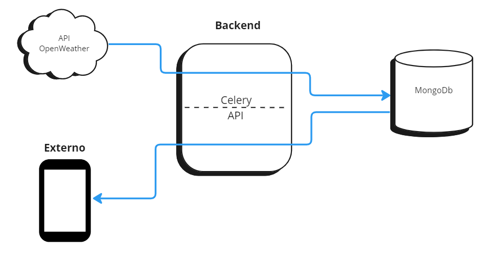

# Desafio-Backend

Este projeto é a resolução do desafio da Miio para desenvolvedor Backend. Se trata de uma API que fornece informações climáticas de todas os concelhos de Portugal e conta com os seguintes endpoints:

- Lista de localizações disponíveis para serem consultadas
- Média da temperatura mínima e máxima para cada dia (nos próximos 5 dias) para um concelho escolhido pelo utilizador
- Os 10 concelhos em que o sol nasce mais cedo para um dia escolhido pelo utilizador
- Os 10 concelhos com menos vento por dia (uma média dos 5 dias)


*Fluxo de dados a aplicação*

Como está ilustrado na imagem, na aplicação do Backend, o Celery é o responsável por atualizar o banco de dados MongoDB que está hospedado em um container Docker, enquanto isso, o Flask é responsavel por fornecer as rotas que buscam a informação necessária no banco.

O Docker Compose é responsável por subir todas as instâncias necessárias para a aplicação:

- API **Flask** em **Python**
- Banco de dados em **MongoDb**
- Redis para o **Celery**
- Worker para o **Celery**
- Beat para as tarefas periódicas do **Celery**

O processo de atualização de dados é feito de forma assíncrona todos os dias as 3 da manhã. Desta forma é adicionado os dados climáticos para os dias faltantes garantindo que sempre haverá 8 dias à frente do dia atual em dados climáticos.

## Decisões Tomadas

Durante a etapa de planejamento tive que optar por uma outra API de informações climáticas devido à limitação de chamadas gratuitas da [AccuWeather](https://developer.accuweather.com/packages), possui apenas 50 chamadas gratuitas por dia. Como é necessário atualizar os dados de todos os concelhos de Portugal foi decidido utilizar a API da [Open Weather](https://openweathermap.org/price), a qual é possível se fazer 1000 chamadas gratuitas por dia.

Sabendo que seria necessário o Forecast diário das informações climáticas de cada localização existem dois endpoints gratuitos para conseguir estes dados, [One Call API](https://openweathermap.org/api/one-call-3) que entrega dados diários para 8 dias e o [Call 5 day / 3 hour forecast data](https://openweathermap.org/forecast5#name5) que entrega dados para 5 dias com intervalos de 3 horas. A primeira foi escolhida ao invés da segunda por os dados já virem com suas médias diárias.

Para o Endpoint escolhido os argumentos de entrada são as coordenadas do concelho, dessa forma, o banco foi criado contendo inicialmente as informações dos nomes dos concelhos que foram obtidos a partir [deste website](https://geoapi.pt/municipios) em formato Json a partir da arquivo `app/functions.py` que também executa a rotina de polular o banco com os coselhos e suas respectivas coordenadas.

As unidades de medidas utilizadas são do padrão `grau celsius` para temperatura, `segundo` para medida de tempo absoluta e `metro por segundo` para velocidade.

## Instalação

Primeiramente deve-se ter o Docker e o Docker Compose instalados, além disso, deve-se ter também o Redis instalado:

### Linux

``` shell
sudo apt install redis-server
```

### Mac

``` shell
brew install redis
```

### Windows

O Redis não possui uma versão oficial para windows, então o recomendado neste caso é utilizar o WSL (Windows Subsystem for Linux) e fazer a instalação do redis-server para o linux.

A primeira execução do sistema criará o banco de dados e o populará com os primeiros dados de forma sícrona, desta forma, a API só estará disponível a partir do momento em que estiver com os dados prontos para utilização.

Lembre-se que é necessário inserir a sua chave de API da [Open Weather](https://openweathermap.org/api) que é obtida de forma gratuita no cadastro.

A chave deve ser inserida no arquivo `docker-compose.yml` em `<SUACHAVE>`:

``` yml
...
api:
    ports:
      - '5000:5000'
    build: '.'
    container_name: application-API
    environment:
      - APP_ID=<SUACHAVE>
    links:
      - database
    depends_on:
      - database
    networks:
      - backend
...
```

Em seguida, rode o compose para subir os sistema:

``` shell
docker-compose up --build -d
```

Na primeira execução o banco será criado e este processo dura em média **8 minutos**, enquanto isso a API não estará disponível. Após o processo de criação do banco a API estará disponível. Este processo ocorre apenas na primeira vez que o banco é criado.

## Como usar

Ao momento que a aplicação for executada pela primeira vez o banco será criado caso ele ainda não exista, então pode demorar alguns minutos para a aplicação ficar disponível para o uso. A partir deste momento a API vai estar disponível e todas as proximas atualizações diárias do banco serão feitas de maneira assíncrona usando o **Celery**.

### **Rota de disponibilidade da aplicação**:
> **GET** localhost:5000/

Resposta:

``` json
{
  "Status": "Ok"
}
```

### **Rota que lista Concelhos**:
> **GET** localhost:5000/locations

Resposta:

``` json
[
  "Abrantes",
  "Aguiar da Beira",
  "Alandroal",
  ...
]
```

### **Rota que lista medias das temperaturas**:
> **GET** localhost:5000/temperature/< location >

Exemplo:

``` endpoint
localhost:5000/temperature/Aveiro
```

Resposta:

``` json
[
    {
        "date": "25-11-2022",
        "temp_max": 10.91,
        "temp_min": 17.15
    },
    {
        "date": "26-11-2022",
        "temp_max": 9.47,
        "temp_min": 17.76
    },
    ...
]
```

### **Rota que lista 10 Concelhos que o sol nasce antes**:
> **GET** localhost:5000/rank/sunrise/< dd-mm-aaaa >

Exemplo:

``` endpoint
localhost:5000/rank/sunrise/27-11-2022
```

Resposta:

``` json
[
    {
        "name": "Vila Real de Santo António",
        "sunrise": 1669533657,
        "sunrise_txt": "27-11-2022, 07:20:57"
    },
    {
        "name": "Castro Marim",
        "sunrise": 1669533668,
        "sunrise_txt": "27-11-2022, 07:21:08"
    },
    ...
]
```

### **Rota que lista 10 Concelhos cuja media da velocidade dos ventos dos próximos 5 dias é menor**:
> **GET** localhost:5000/rank/wind

Resposta:

``` json
[
    {
        "name": "Melgaço",
        "wind_speed_avg": 1.904
    },
    {
        "name": "Monção",
        "wind_speed_avg": 2.068
    },
    ...
]
```

## Desafios

 Como sempre que tive que agendar alguma rotina eu utilizei o próprio crontab do Linux, tive que estudar bastante a documentação do Celery e ver alguns exemplos para aplicar nesta aplicação.

 Algumas requisições no banco não se comportaram como eu esterei no inicio, o que me forçou a voltar a ler a documentação do mongodb.

## Considerações Finais

Eu já havia trabalhado com programação assíncrona, porém apenas utilizando threads, então foi minha primeira experiência com o Celery, achei essa ferramenta fantástica.

Além disso, agradeço muito a Miio pela oportunidade de primeiro conhece-los e segundo participar desta etapa que me desafiou e me deu uma enorme satisfação de desenvolver.

A semana deste desafio é a semana do meu casamento 😅, então foi uma semana com muitas coisas para fazer e muitas preocupações, porém consegui organizar meu tempo e minhas atividades a fim de entregar o projeto.

## Autor

Yuri L. Almeida
